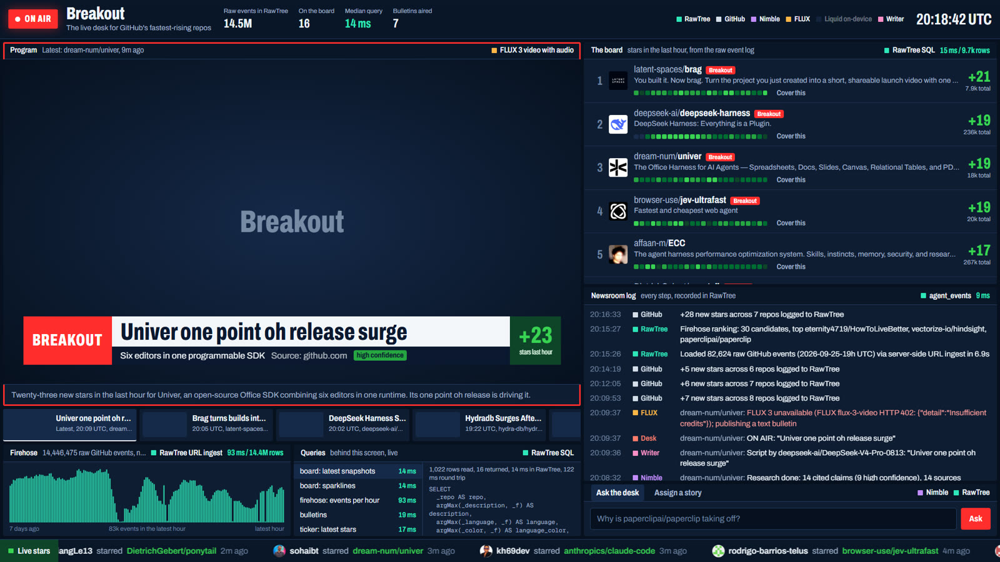

# Breakout

Breakout is a live AI news desk for the fastest-rising open-source projects on GitHub.
It watches the entire public GitHub firehose, spots repos breaking out, researches why on the live web, and goes on air with a cited bulletin.
It runs all day, remembers everything it has reported, and resumes exactly where it left off after a crash.

## The problem

- **The signal is buried.** GitHub's public firehose carries millions of raw events a week. The repo gaining a hundred stars an hour is in there, but nobody is watching all of it.
- **The why lives somewhere else.** Why a project is taking off is scattered across Hacker News, Reddit, X, blogs and launch posts. By the time a VC, a devrel team or a developer pieces it together, the moment has passed.
- **Long-running agents fall apart.** Agents that run all day lose their state, repeat themselves, and can't show what they did or why.

## Our solution

An always-on newsroom agent whose memory, analytics and flight recorder all live in one schemaless database.

1. **Watch.** Every hour the full GH Archive firehose lands in RawTree via server-side URL ingest, raw JSON with no schema. A week of it is 14.4M events (2.15 GB).
2. **Detect.** RawTree SQL ranks candidates across the firehose, then each candidate's own event feed is logged to measure exact star velocity. A breakout opens a story.
3. **Remember.** Before anything else, the desk asks RawTree what it already reported about this repo, so follow-ups say what changed instead of repeating themselves.
4. **Triage.** A Liquid LFM2.5 model on the laptop labels the repo before any paid call.
5. **Research.** A Nimble Web Search Agent finds out why it is trending and returns cited, confidence-graded claims.
6. **Broadcast.** An OpenAI-compatible LLM writes a 12-second script, FLUX 3 renders the anchor reading it, and the control room airs it with the sources as on-screen captions.

Every step is written to RawTree as an event. The same log drives the live control room, lets a restarted worker pick up unfinished stories, and is what judges can query through **Ask the desk**, an agent that combines Nimble's web tools with RawTree SQL.

## Sponsors

| Sponsor | Role in Breakout | What to look at |
| --- | --- | --- |
| **RawTree (Tinybird)** | Memory, analytics and flight recorder | Latency on every dashboard tile, the 7-day firehose chart, the newsroom log |
| **Nimble** | The agent's eyes on the live web | Research progress in the log, cited claims on air, Ask the desk tools |
| **Black Forest Labs (FLUX)** | The anchor's face and voice | FLUX 3 bulletins with a consistent anchor |
| **Liquid AI** | On-device reflexes | Category labels on the board, triage before any paid call |

## RawTree (Tinybird)

- **Big data, raw.** 14.4M GitHub events (2.15 GB) from a week of GH Archive, each hour pulled server-side from a public URL in about 7 seconds. No schema anywhere: GitHub payloads, Nimble trust reports and AI SDK spans are stored exactly as the APIs return them, and types are applied in SQL.
- **User-facing, low latency.** Every tile in the control room is a live RawTree query with its execution time in the tile header. The median dashboard query runs in about 15 ms; the heaviest, an hourly roll-up across all 14.4M rows, in under 100 ms.
- **The agent's memory and flight recorder.** Every step the desk takes is an event in `agent_events`. The UI reads it live, story memory is a SQL lookup, requests from the floor arrive through it, and a crashed worker resumes from it without duplicating work.
- **Agents and humans on the same data.** Ask the desk gives an LLM two RawTree tools: `repoStats`, a parameterized query endpoint, and guarded read-only SQL. It writes its own queries against the firehose.
- **Observability built in.** `@rawtree/otel` exports every AI SDK call (scripts, Ask the desk) as OpenTelemetry spans into the same database.

## Nimble

- **A persistent research agent.** Every story runs on one named Web Search Agent, `breakout-desk`, so Nimble's own memory of sources and retrieval paths compounds across stories.
- **Cited and graded.** Each run returns 14 to 21 claims with source URLs and confidence grades. The best-supported ones become the captions under the anchor, with their source and grade on screen.
- **Live progress.** Run state and sources read stream over server-sent events into the newsroom log.
- **Integrated into an AI agent.** Ask the desk registers Nimble's official AI SDK tools (`nimbleSearch`, `nimbleExtract`) alongside RawTree tools, so the agent decides when to search the web and when to query the data.
- **Social pulse.** Nimble Search with the social focus counts this week's posts about each project.

## Black Forest Labs (FLUX)

- **A consistent anchor.** FLUX.2 [pro] casts a fictional anchor once. Every bulletin pins that exact still as frame one of a FLUX 3 image-to-video render, so the same person is on air all day.
- **Spoken, lip-synced bulletins.** The prompt quotes the script, names the speaker and forbids on-screen text, so FLUX 3 speaks the line rather than burning it in. Our own captions are overlaid in the browser.
- **Draft, then final.** Bulletins render as fast drafts; "Render final cut" promotes a keeper with `draft_enhance`, same shot and seed at full quality.
- **Status.** Wired end to end, but our BFL account had no credits during the event, so bulletins currently air as text. Rendering starts the moment credits land, with no code change.

## Liquid AI

- **On-device triage.** LFM2.5-1.2B runs on the demo laptop behind an OpenAI-compatible server (Ollama or llama.cpp) and labels each repo with a category and a one-line summary before any paid call.
- **Private and free.** Labels cost nothing per call and repo data never leaves the machine for this step. The board shows each label with its on-device latency.
- **The backup brain.** If the cloud model fails, the same local model writes the script and can answer Ask the desk, so the newsroom keeps running.
